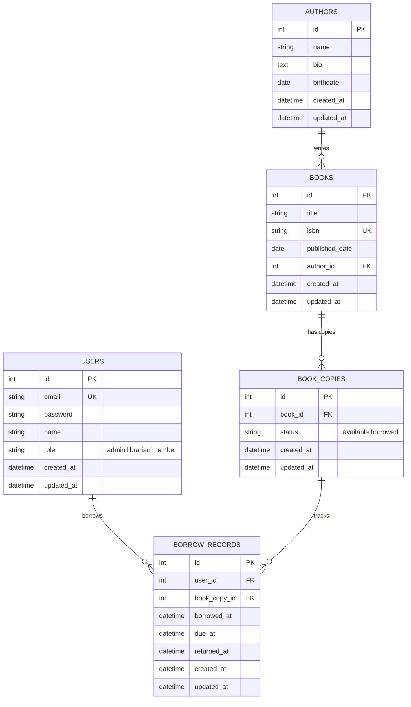

# Data Models (ERD)

Entity-Relationship diagrams for the Library API database schema.

---

## Database Overview

| Database | Tables | Relationships |
|----------|--------|---------------|
| SQLite (dev) / PostgreSQL (prod) | 5 tables | 4 foreign keys |

---

## Entity-Relationship Diagram (Mermaid)

---

## Table Details

### `users`

| Column | Type | Constraints | Description |
|--------|------|-------------|-------------|
| `id` | INTEGER | PK, Auto-increment | Primary key |
| `email` | VARCHAR | UNIQUE, NOT NULL | User email (login) |
| `password` | VARCHAR | NOT NULL | Argon2 hashed password |
| `name` | VARCHAR | NOT NULL | User's full name |
| `role` | VARCHAR(12) | NOT NULL, DEFAULT 'member' | `admin`, `librarian`, `member` |
| `created_at` | DATETIME | NOT NULL, DEFAULT NOW() | Record creation |
| `updated_at` | DATETIME | NOT NULL, DEFAULT NOW() ON UPDATE | Last update |

**Indexes:** Primary Key (`id`), Unique (`email`)

---

### `authors`

| Column | Type | Constraints | Description |
|--------|------|-------------|-------------|
| `id` | INTEGER | PK, Auto-increment | Primary key |
| `name` | VARCHAR(50) | NOT NULL | Author's name |
| `bio` | TEXT | NULLABLE | Biography |
| `birthdate` | DATE | NULLABLE | Date of birth |
| `created_at` | DATETIME | NOT NULL, DEFAULT NOW() | Record creation |
| `updated_at` | DATETIME | NOT NULL, DEFAULT NOW() ON UPDATE | Last update |

**Indexes:** Primary Key (`id`)

---

### `books`

| Column | Type | Constraints | Description |
|--------|------|-------------|-------------|
| `id` | INTEGER | PK, Auto-increment | Primary key |
| `title` | VARCHAR(100) | NOT NULL | Book title |
| `isbn` | VARCHAR | UNIQUE, NOT NULL, INDEX | ISBN-13 |
| `published_date` | DATE | NULLABLE | Publication date |
| `author_id` | INTEGER | FK → authors.id, NOT NULL | Author reference |
| `created_at` | DATETIME | NOT NULL, DEFAULT NOW() | Record creation |
| `updated_at` | DATETIME | NOT NULL, DEFAULT NOW() ON UPDATE | Last update |

**Indexes:** Primary Key (`id`), Unique (`isbn`), Foreign Key (`author_id`)

---

### `book_copies`

| Column | Type | Constraints | Description |
|--------|------|-------------|-------------|
| `id` | INTEGER | PK, Auto-increment | Primary key |
| `book_id` | INTEGER | FK → books.id, NOT NULL | Book reference |
| `status` | VARCHAR(15) | NOT NULL, DEFAULT 'available' | `available`, `borrowed` |
| `created_at` | DATETIME | NOT NULL, DEFAULT NOW() | Record creation |
| `updated_at` | DATETIME | NOT NULL, DEFAULT NOW() ON UPDATE | Last update |

**Indexes:** Primary Key (`id`), Foreign Key (`book_id`)

---

### `borrow_records`

| Column | Type | Constraints | Description |
|--------|------|-------------|-------------|
| `id` | INTEGER | PK, Auto-increment | Primary key |
| `user_id` | INTEGER | FK → users.id, NOT NULL | Borrower |
| `book_copy_id` | INTEGER | FK → book_copies.id, NOT NULL | Borrowed copy |
| `borrowed_at` | DATETIME | NOT NULL | When borrowed |
| `due_at` | DATETIME | NOT NULL | Due date (14 days) |
| `returned_at` | DATETIME | NULLABLE | When returned |
| `created_at` | DATETIME | NOT NULL, DEFAULT NOW() | Record creation |
| `updated_at` | DATETIME | NOT NULL, DEFAULT NOW() ON UPDATE | Last update |

**Indexes:** Primary Key (`id`), Foreign Keys (`user_id`, `book_copy_id`)

---

## Key Design Decisions

| Decision | Rationale |
|----------|-----------|
| **Separate `book_copies` table** | Track individual physical copies, availability status |
| **`borrow_records` links to `book_copies` not `books`** | Specific copy tracking, condition/history per copy |
| **`due_at` = `borrowed_at` + 14 days** | Standard library loan period |
| **`returned_at` NULL = active borrow** | Simple active/returned distinction |
| **`role` as VARCHAR enum** | Simplicity; PostgreSQL ENUM also possible |
| **`status` on `book_copies`** | Denormalized for fast availability queries |
| **`created_at`/`updated_at` on all tables** | Audit trail, debugging |

---

## Next Steps

- [System Architecture](system-architecture.md) - High-level architecture
- [API Endpoints](api-endpoints.md) - Complete endpoint reference
