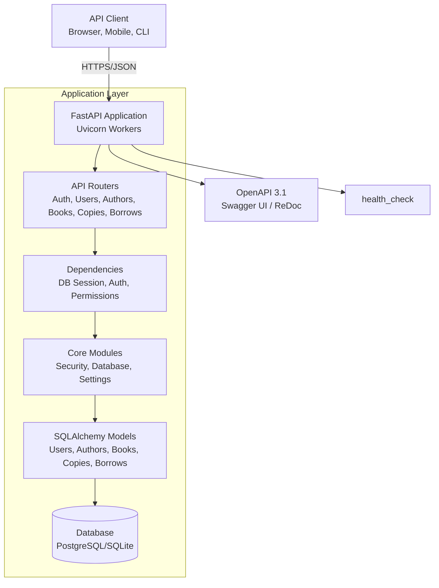
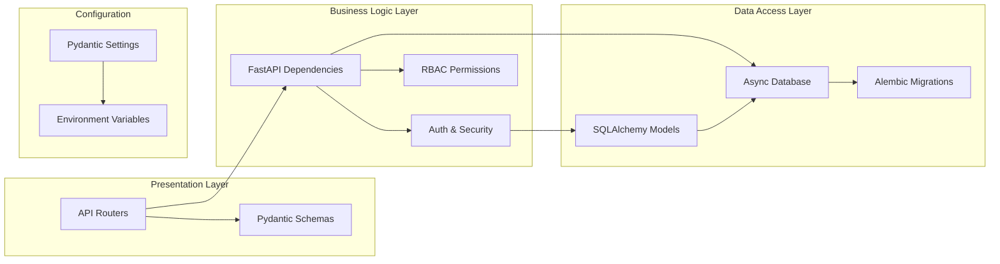
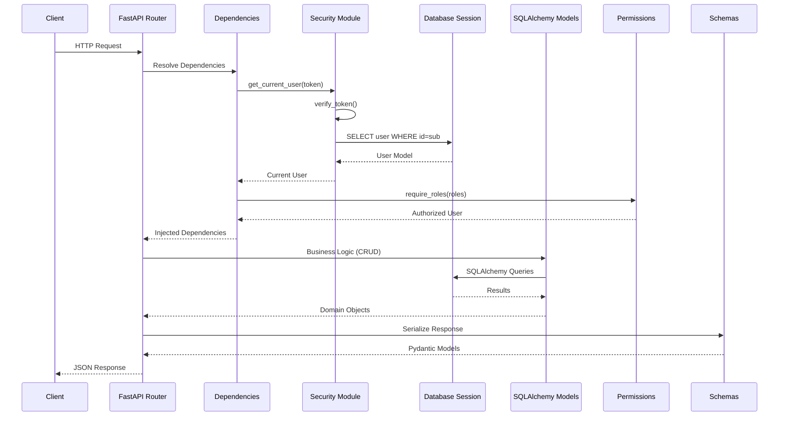
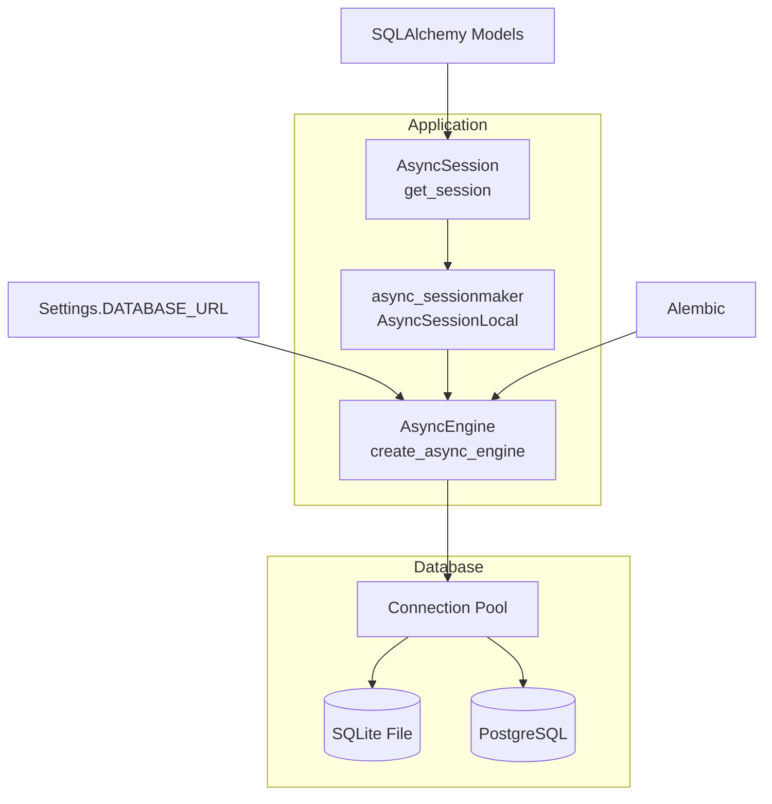
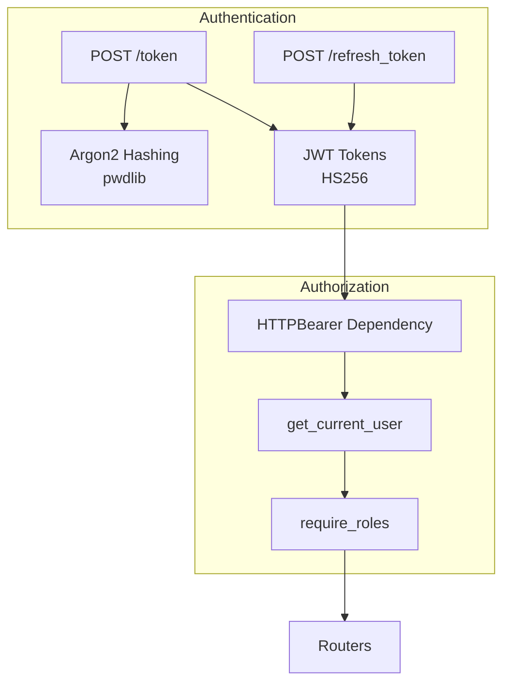
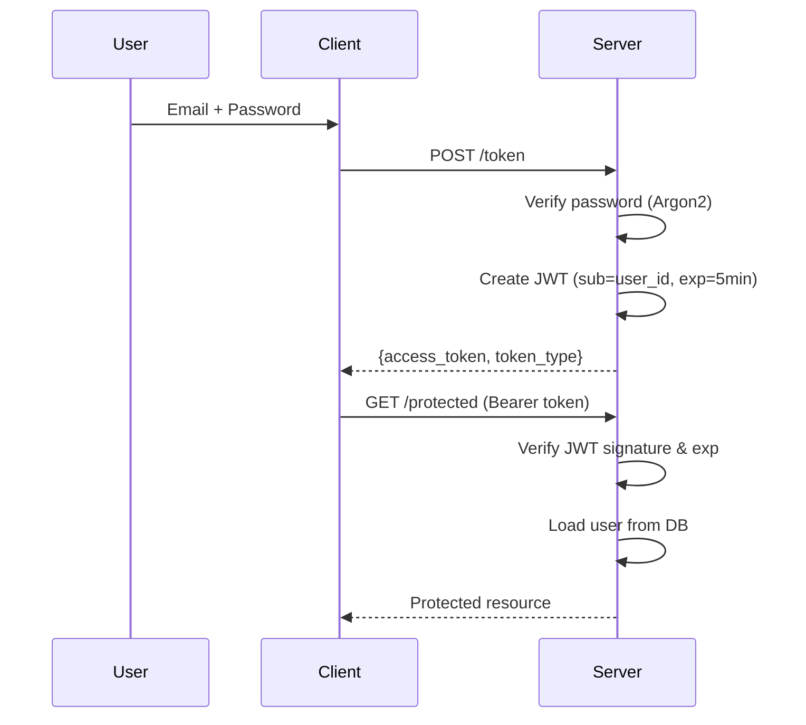

# System Architecture

High-level architecture diagrams and design documentation for the Library API.

---

## High-Level Architecture



---

## Component Architecture



---

## Request Processing Flow



---

## Database Architecture



---

## Security Architecture



### Token Flow



---

## API Layer Architecture

### Router Organization

```
library_api/routers/
├── auth.py              # Public: /token, /refresh_token
├── users.py             # Admin: CRUD users
├── authors.py           # Admin/Librarian: CRUD authors; All: read
├── books.py             # Admin/Librarian: CRUD books; All: read
├── book_copies.py       # Admin/Librian: CRUD copies; All: read
└── borrow_records.py    # All: borrow/return; Admin/Librarian: list/delete
```

---

## Next Steps

- [Data Models (ERD)](data-models-erd.md) - Database schema
