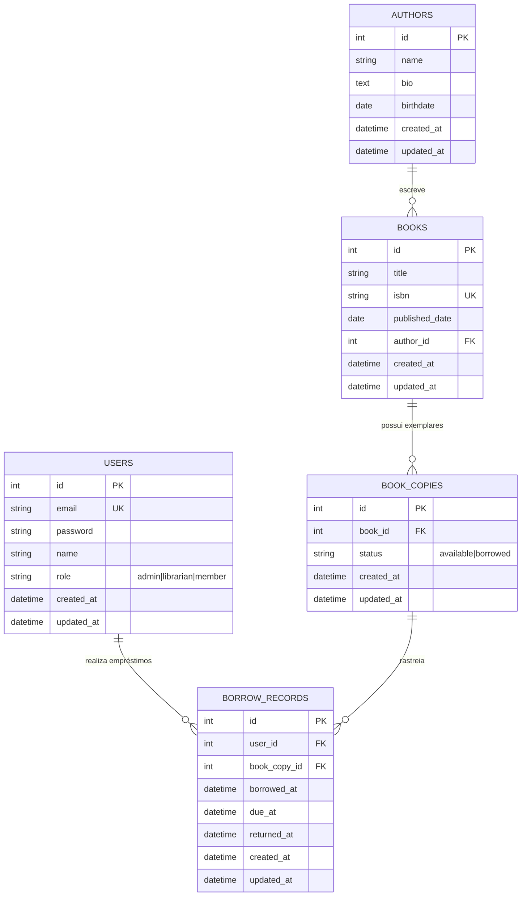

# Modelos de Dados (ERD)

Diagramas de Entidade-Relacionamento para o esquema de banco de dados da API da Biblioteca.

---

## Visão Geral do Banco de Dados

| Banco de Dados | Tabelas | Relacionamentos |
|----------------|---------|-----------------|
| SQLite (dev) / PostgreSQL (prod) | 5 tabelas | 4 chaves estrangeiras |

---

## Diagrama Entidade-Relacionamento (Mermaid)

---

## Detalhes da Tabela

### `users`

| Coluna | Tipo | Restrições | Descrição |
|--------|------|-------------|-------------|
| `id` | INTEGER | PK, Auto-incremento | Chave primária |
| `email` | VARCHAR | UNIQUE, NOT NULL | E-mail do usuário (login) |
| `password` | VARCHAR | NOT NULL | Senha com hash Argon2 |
| `name` | VARCHAR | NOT NULL | Nome completo do usuário |
| `role` | VARCHAR(12) | NOT NULL, DEFAULT 'member' | `admin`, `librarian`, `member` |
| `created_at` | DATETIME | NOT NULL, DEFAULT NOW() | Criação do registro |
| `updated_at` | DATETIME | NOT NULL, DEFAULT NOW() ON UPDATE | Última atualização |

**Índices:** Chave Primária (`id`), Único (`email`)

---

### `authors`

| Coluna | Tipo | Restrições | Descrição |
|--------|------|-------------|-------------|
| `id` | INTEGER | PK, Auto-incremento | Chave primária |
| `name` | VARCHAR(50) | NOT NULL | Nome do autor |
| `bio` | TEXT | NULLABLE | Biografia |
| `birthdate` | DATE | NULLABLE | Data de nascimento |
| `created_at` | DATETIME | NOT NULL, DEFAULT NOW() | Criação do registro |
| `updated_at` | DATETIME | NOT NULL, DEFAULT NOW() ON UPDATE | Última atualização |

**Índices:** Chave primária (`id`)

---

### `books`

| Coluna | Tipo | Restrições | Descrição |
|--------|------|-------------|-------------|
| `id` | INTEGER | PK, Auto-incremento | Chave primária |
| `title` | VARCHAR(100) | NOT NULL | Título do livro |
| `isbn` | VARCHAR | UNIQUE, NOT NULL, INDEX | ISBN-13 |
| `published_date` | DATE | NULLABLE | Data de publicação |
| `author_id` | INTEGER | FK → authors.id, NOT NULL | Referência ao autor |
| `created_at` | DATETIME | NOT NULL, DEFAULT NOW() | Criação do registro |
| `updated_at` | DATETIME | NOT NULL, DEFAULT NOW() ON UPDATE | Última atualização |

**Índices:** Chave Primária (`id`), Único (`isbn`), Chave Estrangeira (`author_id`)

---

### `book_copies`

| Coluna | Tipo | Restrições | Descrição |
|--------|------|-------------|-------------|
| `id` | INTEGER | PK, Auto-incremento | Chave primária |
| `book_id` | INTEGER | FK → books.id, NOT NULL | Referência ao livro |
| `status` | VARCHAR(15) | NOT NULL, DEFAULT 'available' | `available`, `borrowed` |
| `created_at` | DATETIME | NOT NULL, DEFAULT NOW() | Criação do registro |
| `updated_at` | DATETIME | NOT NULL, DEFAULT NOW() ON UPDATE | Última atualização |

**Índices:** Chave Primária (`id`), Chave Estrangeira (`book_id`)

---

### `borrow_records`

| Coluna | Tipo | Restrições | Descrição |
|--------|------|-------------|-------------|
| `id` | INTEGER | PK, Auto-incremento | Chave primária |
| `user_id` | INTEGER | FK → users.id, NOT NULL | Usuário que realizou o empréstimo |
| `book_copy_id` | INTEGER | FK → book_copies.id, NOT NULL | Exemplar emprestado |
| `borrowed_at` | DATETIME | NOT NULL | Data do empréstimo |
| `due_at` | DATETIME | NOT NULL | Data de devolução (14 dias) |
| `returned_at` | DATETIME | NULLABLE | Data da devolução |
| `created_at` | DATETIME | NOT NULL, DEFAULT NOW() | Criação do registro |
| `updated_at` | DATETIME | NOT NULL, DEFAULT NOW() ON UPDATE | Última atualização |

**Índices:** Chave Primária (`id`), Chaves Estrangeiras (`user_id`, `book_copy_id`)

---

## Principais Decisões de Design

| Decisão | Justificativa |
|----------|-----------|
| **Tabela `book_copies` separada** | Rastrear exemplares físicos individuais e status de disponibilidade |
| **`borrow_records` vinculada a `book_copies`, não a `books`** | Rastreamento de exemplar específico; condição/histórico por exemplar |
| **`due_at` = `borrowed_at` + 14 dias** | Período padrão de empréstimo da biblioteca |
| **`returned_at` como NULL = empréstimo ativo** | Distinção simples entre ativo e devolvido |
| **`role` como VARCHAR (enum)** | Simplicidade; uso de ENUM do PostgreSQL também é possível |
| **`status` na tabela `book_copies`** | Desnormalizado para consultas rápidas de disponibilidade |
| **`created_at`/`updated_at` em todas as tabelas** | Rastro de auditoria, depuração |

---

## Próximos Passos

- [Arquitetura do Sistema](system-architecture.md)
- [Endpoints da API](api-endpoints.md)
