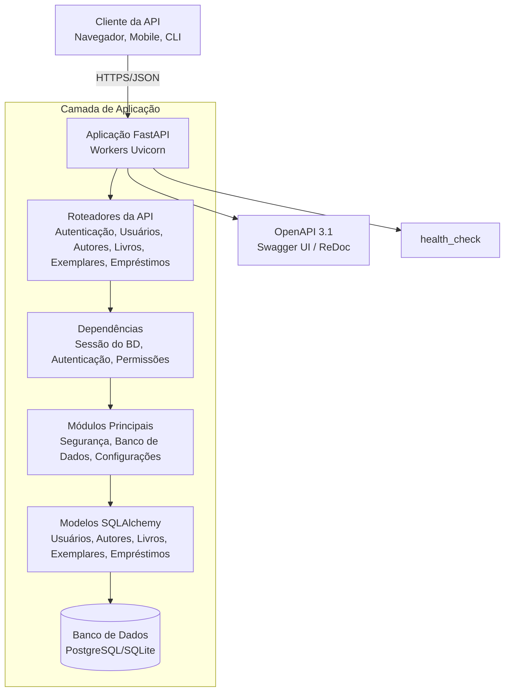
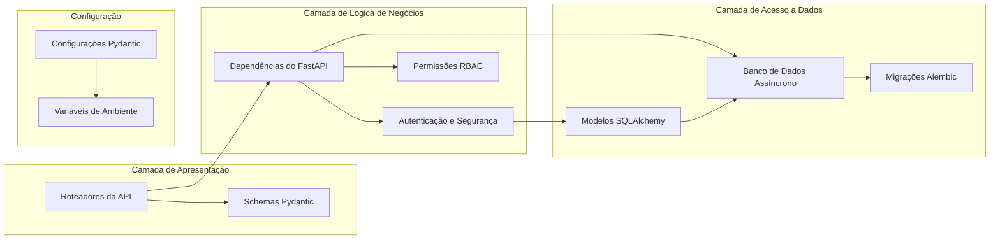
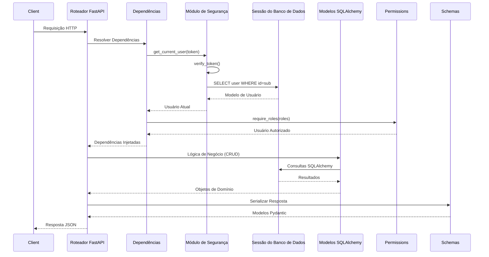
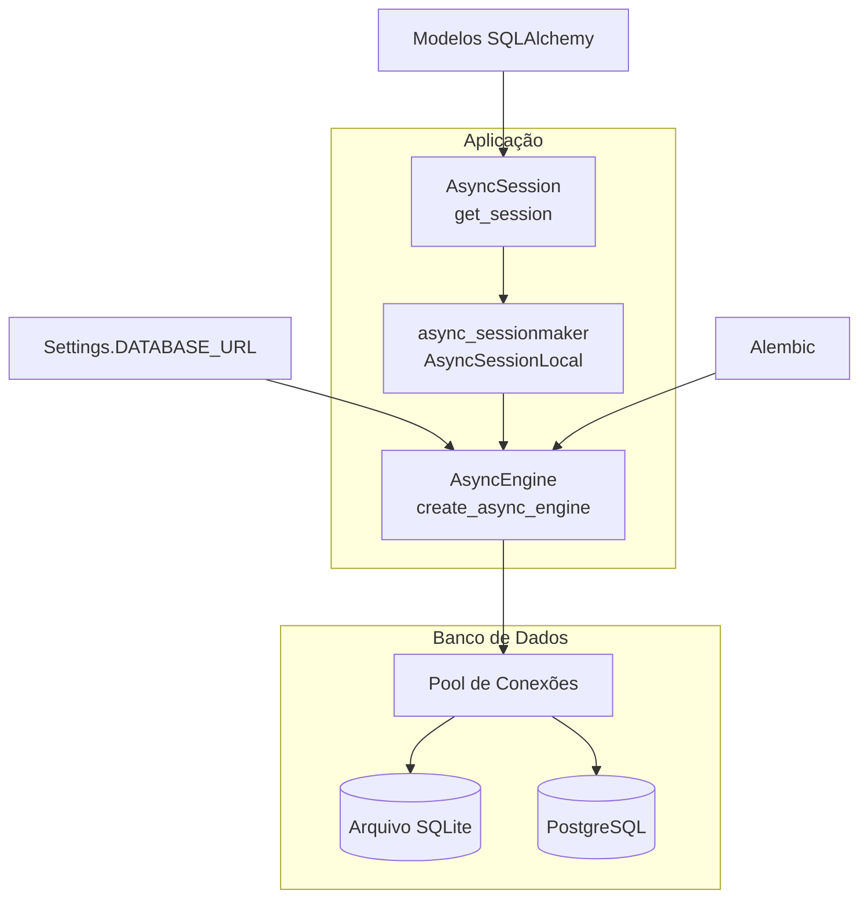
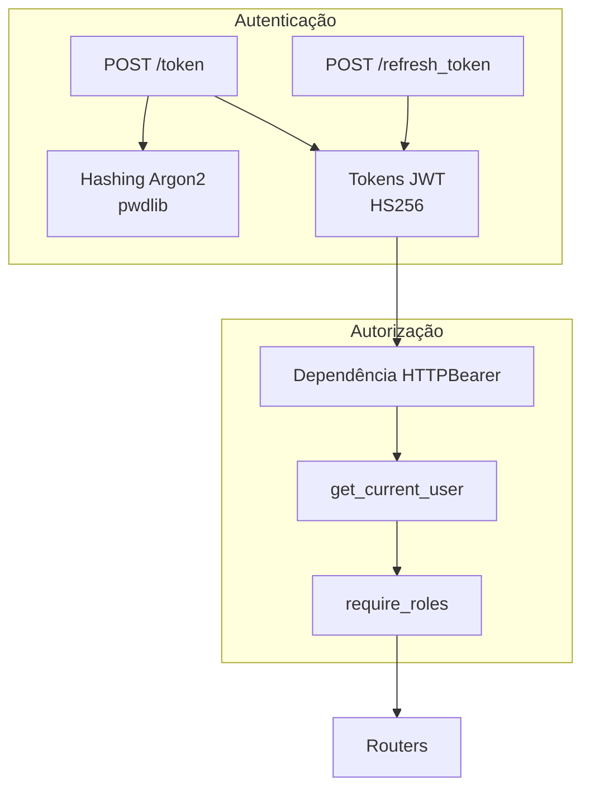
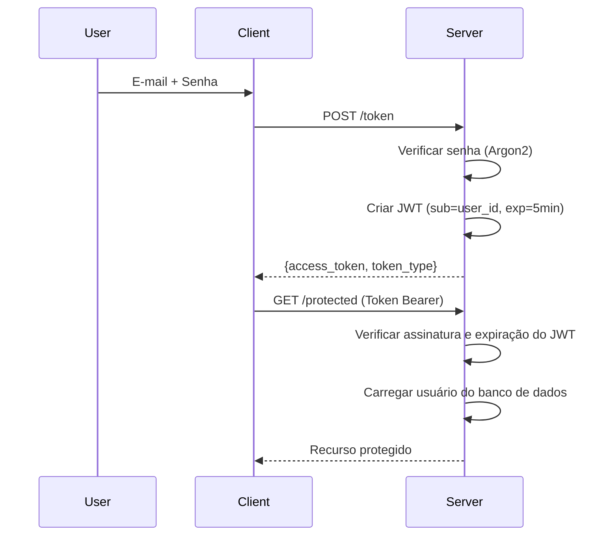

# Arquitetura do Sistema

Diagramas de arquitetura de alto nível e documentação de projeto da Library API.

---



---

## Arquitetura de Componentes



---

## Fluxo de Processamento de Requisições



---

## Arquitetura do Banco de Dados



---

## Arquitetura de Segurança



### Fluxo de Token



---

## Arquitetura da Camada de API

### Organização dos Roteadores

```
library_api/routers/
├── auth.py              # Público: /token, /refresh_token
├── users.py             # Admin: CRUD de usuários
├── authors.py           # Admin/Bibliotecário: CRUD de autores; Todos: leitura
├── books.py             # Admin/Bibliotecário: CRUD de livros; Todos: leitura
├── book_copies.py       # Admin/Bibliotecário: CRUD de exemplares; Todos: leitura
└── borrow_records.py    # Todos: empréstimo/devolução; Admin/Bibliotecário: listar/excluir
```

---

## Próximos Passos

- [Modelos de Dados (ERD)](data-models-erd.md)